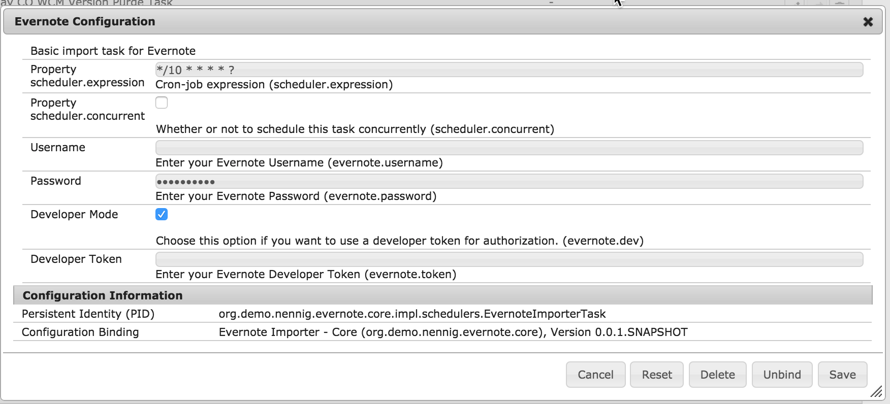

# Evernote Import into AEM Project

Evernote: [https://evernote.com/](https://evernote.com/)

This is a proof of concept project. I wanted to be able to show how easily you can create custom importers or sync tools into the JCR. This project has a interface called ImporterService that can be used to create other third party integrations to import data. Currently only the import works. I'll be be building a Evernote viewer component at a later date.

Any Evernote notes made with the [Evernote Web Clipper](https://evernote.com/webclipper/) within the last day will automatically be imported into /dam/evernote/<guid of the note> as an asset.

You need to use a production Evernote dev token in order to access the Evernote account that's connected to the Web Clipper.

## Modules

The main parts are:

* core: Java code to create the import from Evernote. 

 * Currently the integration works specifically with Evernote Clipper. 

     * [Download Evernote Web Clipper](https://evernote.com/webclipper/)
	
 * Note: Currently authentication is only supported by developer key.

	 * [Get an Evernote dev token](https://dev.evernote.com/doc/articles/dev_tokens.php)
 
 * OSGi Configurations:
 
 

* ui.apps:
 * The main component is components/content/evernote
   * Once Evernote assets are imported, they can be added to the evernote component via the AssetFinder under the group called "Evernote Notes"
 * config nodes for custom logs, service user mapping, and this projects config
 * There are also some basic page and general components to use with the demo
* ui.content: A basic website to use the Evernote component

## How to build

To build all the modules run in the project root directory the following command with Maven 3:

    mvn clean install

If you have a running AEM instance you can build and package the whole project and deploy into AEM with  

    mvn clean install -PautoInstallPackage
    
Or to deploy it to a publish instance, run

    mvn clean install -PautoInstallPackagePublish
    
Or to deploy only the bundle to the author, run

    mvn clean install -PautoInstallBundle

## Maven settings

The project comes with the auto-public repository configured. To setup the repository in your Maven settings, refer to:

    http://helpx.adobe.com/experience-manager/kb/SetUpTheAdobeMavenRepository.html
   
## Future Goals
* Implement OAuth for authentication
* Import the Evernote tags into AEM as cq:tags
* Allow for a custom initial import
* Ability to preview the imported Evernote note in /assets.html
